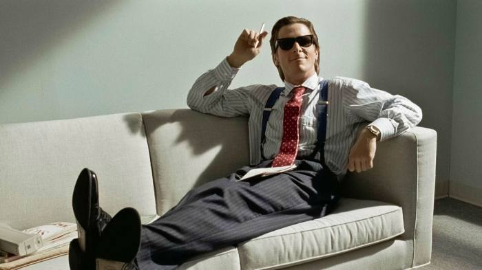
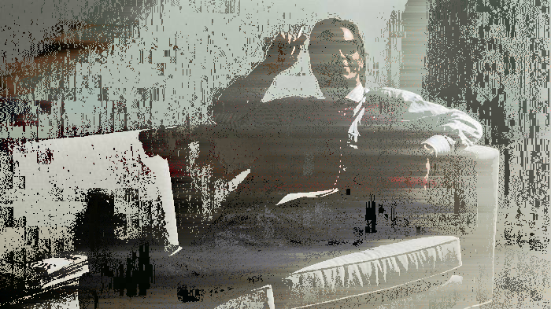
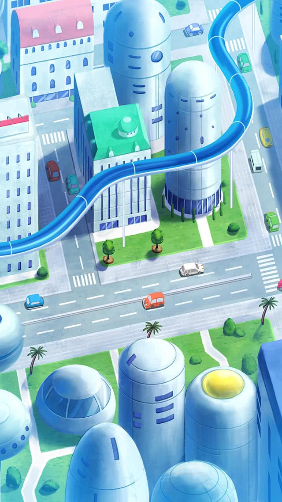
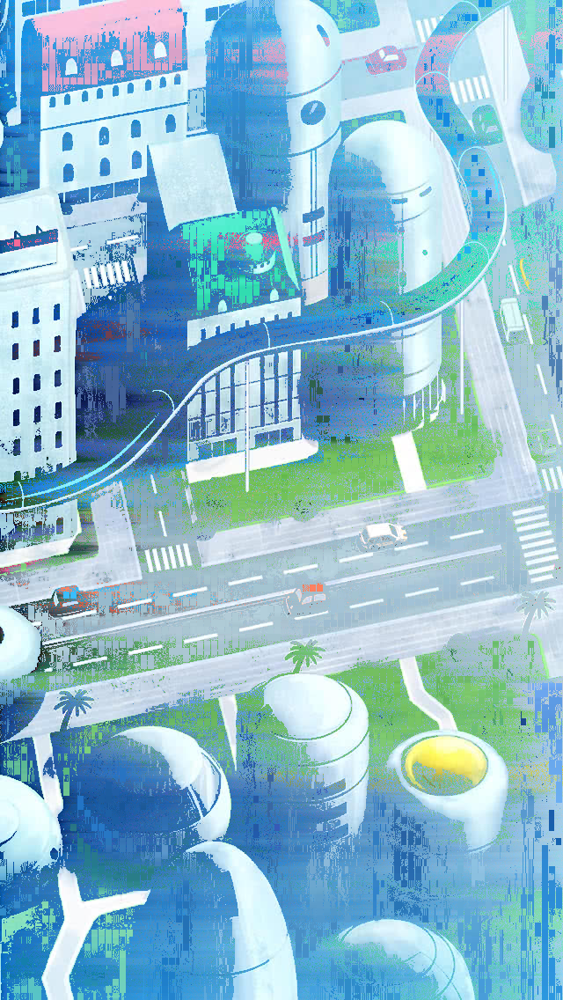
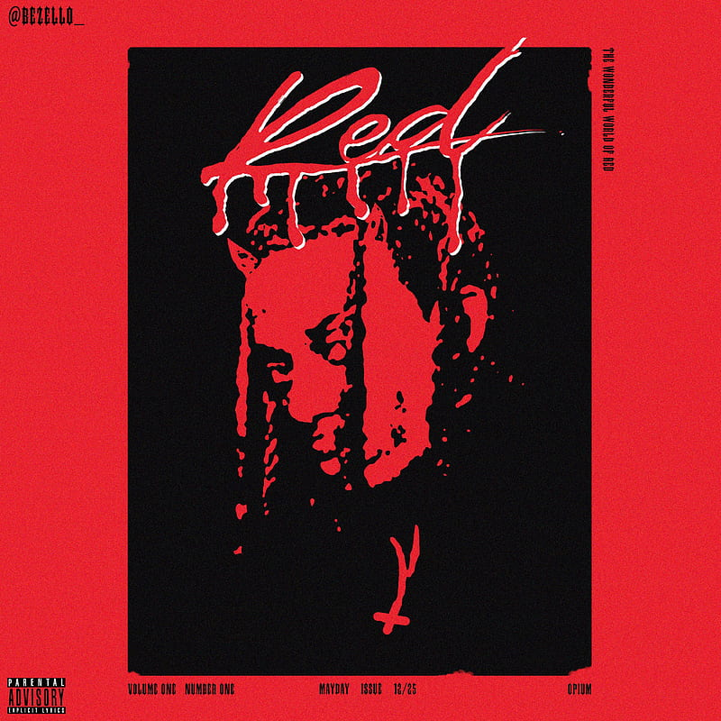
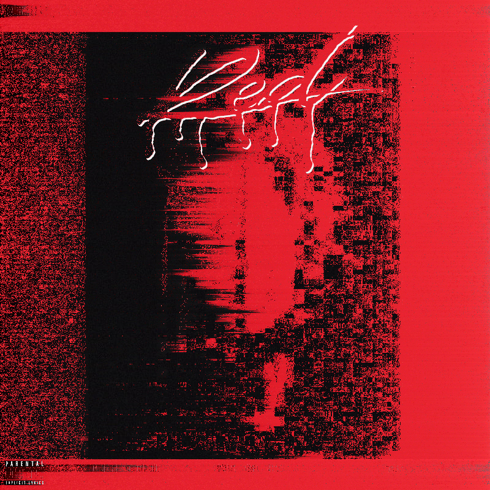
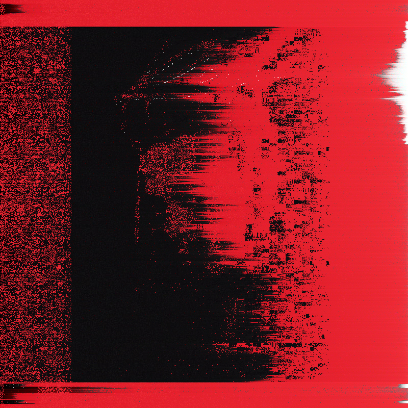

# Pixel FX

Add creative effects to your images.

<div style="float: left;">



</div>

<div style="float: left;">



</div>

<div style="float: left;">



</div>

### Effects
**Pixel Sorting:** 
*nSwaps: # of pixel swaps per frame, w and h: width and height of swap region*
<br>
**Random Swap:**
*thresh: luminance threshold*
<br>

*More to come...*

Include ```n``` in certain parameters to change effect with frame: *thresh=```n*100```*
